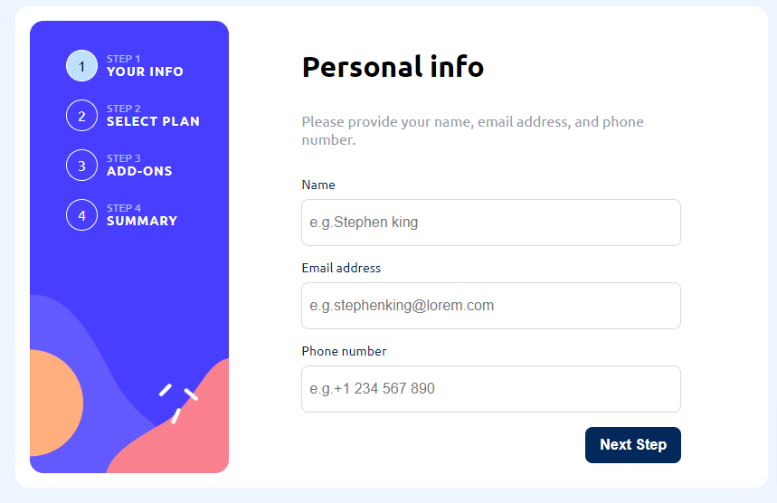

# Frontend Mentor - Multi-step form solution

This is a solution to the [Multi-step form challenge on Frontend Mentor](https://www.frontendmentor.io/challenges/multistep-form-YVAnSdqQBJ). Frontend Mentor challenges help you improve your coding skills by building realistic projects. 

## Table of contents

- [Overview](#overview)
  - [The challenge](#the-challenge)
  - [Screenshot](#screenshot)
  - [Links](#links)
- [My process](#my-process)
  - [Built with](#built-with)
  - [What I learned](#what-i-learned)
  - [Continued development](#continued-development)
  - [Useful resources](#useful-resources)
- [Author](#author)

## Overview

### The challenge

Users should be able to:

- Complete each step of the sequence
- Go back to a previous step to update their selections
- See a summary of their selections on the final step and confirm their order
- View the optimal layout for the interface depending on their device's screen size
- See hover and focus states for all interactive elements on the page
- Receive form validation messages if:
  - A field has been missed
  - The email address is not formatted correctly
  - A step is submitted, but no selection has been made

### Screenshot

## My process

### Links

- Solution URL: [Repo](https://github.com/elian-dev/multi-step-form-main)
- Live Site URL: [Live site](https://multi-step-form-main-dusky.vercel.app/)

### Built with
- Semantic HTML5 markup
- Custom HTML elements
- Flexbox
- CSS Grid
- Mobile-first workflow
- [ASTRO.js](https://astro.build/)
- [SASS](https://sass-lang.com/) - For styles

### What I learned

I learn how to prepare my project for future API integrations, and the complexity of managing a global state with vanilla js.
I wanted to use some observer APIs and learn more about them. 
My estimated time to finish this task was 3 days, but at the end it takes me one week, so I needed to continue practicing.

### Continued development

- How to estimate the time
- Analyze the componentization 
- How to create more reusable functions

### Useful resources

- [Web components with custom elements](https://docs.astro.build/en/guides/client-side-scripts/#web-components-with-custom-elements) - This helped me because Astro doesn't let access to browsers API, and I was working with the local storage and observing events in the dom.

## Author

- Website - [elian-dev](https://github.com/elian-dev)
- Frontend Mentor - [@elian-dev](https://www.frontendmentor.io/profile/elian-dev)
